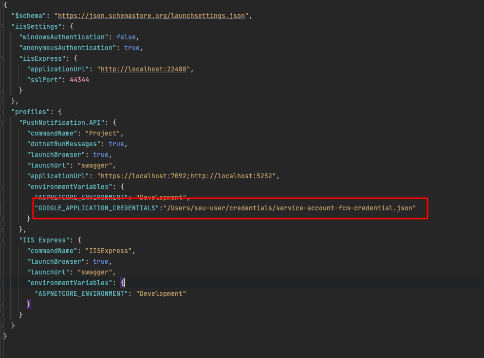
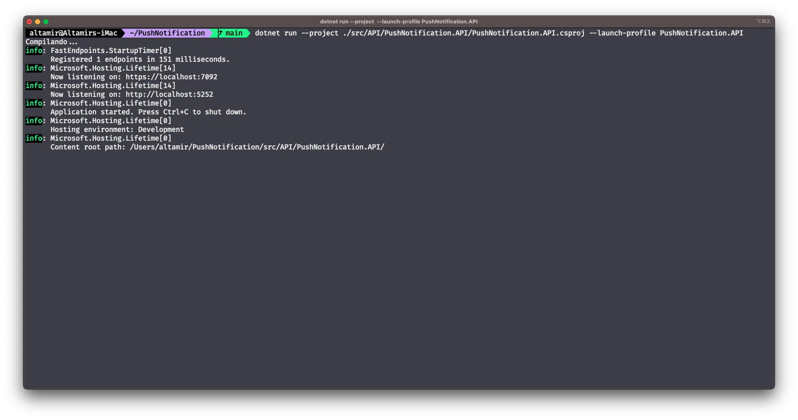
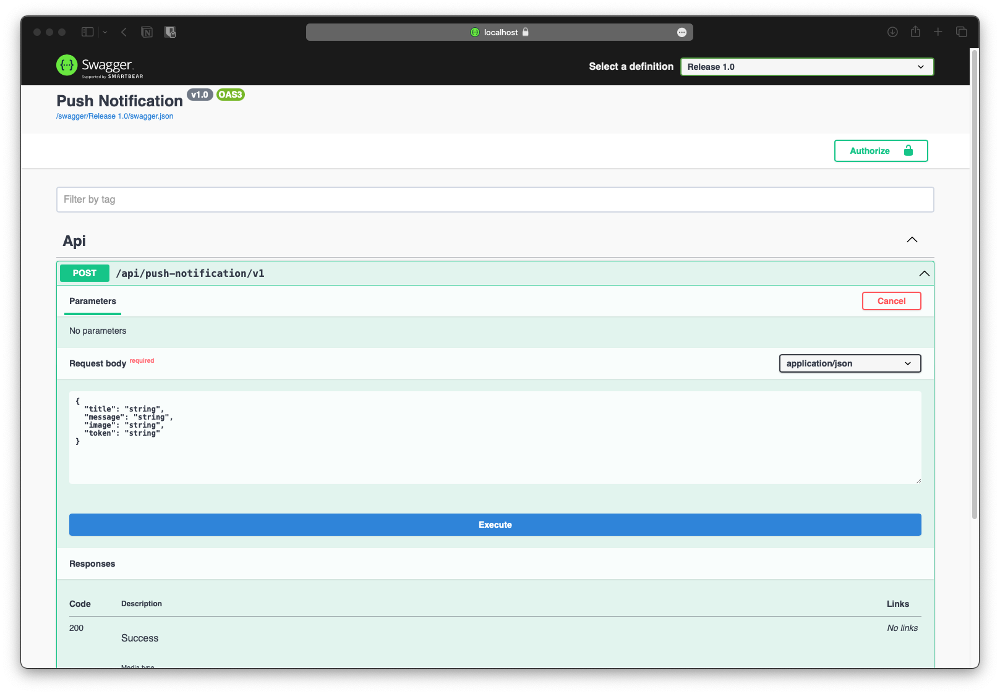

# PushNotification

API para envio de push notification para device especifico, utilizando Firebase.Admin. Desenvolvido utilizando FastEndpoints. 

## Objetivo

O projeto tem como objetivo colocar em pratica o estudo de integração com ferramenta de push notification da Google [(*FCM*)](https://firebase.google.com/docs/cloud-messaging).

Para atingir o objetivo utilizou-se [*FastEndpoints*](https://fast-endpoints.com):

```
O FastEndpoints é uma alternativa amigável ao desenvolvedor para Minimal APIs e MVC

Ele empurra você para o REPR Design Pattern (Request-Endpoint-Response) para uma criação de endpoint conveniente e sustentável com praticamente nenhum padrão.

O desempenho está em pé de igualdade com as APIs mínimas. É mais rápido, usa menos memória e faz cerca de 35 mil mais solicitações por segundo do que um Controlador MVC em nossos benchmarks.
```

# Rodando o projeto

Para executar a API primeiro você precisará fazer o download de um arquivo JSON da conta de serviço do seu projeto do Firebase.

## Configurar credenciais

Para autenticar uma conta de serviço e autorizá-la a acessar os serviços do Firebase, você deve gerar um arquivo de chave privada no formato JSON.

Para gerar um arquivo de chave privada para sua conta de serviço:

* No console do Firebase, abra Configurações > [Contas de serviço.](https://console.firebase.google.com/project/_/settings/serviceaccounts/adminsdk)
* Clique em Gerar nova chave privada e confirme clicando em Gerar chave .
* Armazene com segurança o arquivo JSON que contém a chave. Vamos usar o path para configurar uma variável de ambiente no projeto.

Alterar o arquivo [*_./src/API/PushNotification.API/Properties/launchSettings.json_*](./src/API/PushNotification.API/Properties/launchSettings.json) adicionando o caminho do arquivo json:



Como alternativa também pode ser setado como variável de ambiente do SO, 

no windows:
``` powershell
$env:GOOGLE_APPLICATION_CREDENTIALS="C:\Users\username\Downloads\service-account-file.json"
```
no macos:
``` sh
export GOOGLE_APPLICATION_CREDENTIALS="/home/user/Downloads/service-account-file.json"
```

## Executando o projeto

``` zsh
dotnet run --project ./src/API/PushNotification.API/PushNotification.API.csproj --launch-profile PushNotification.API
```


Será possível acessa o Swagger em: 

[https://localhost:7092](https://localhost:7092/swagger/index.html)
[http://localhost:5252](http://localhost:5252/swagger/index.html)

